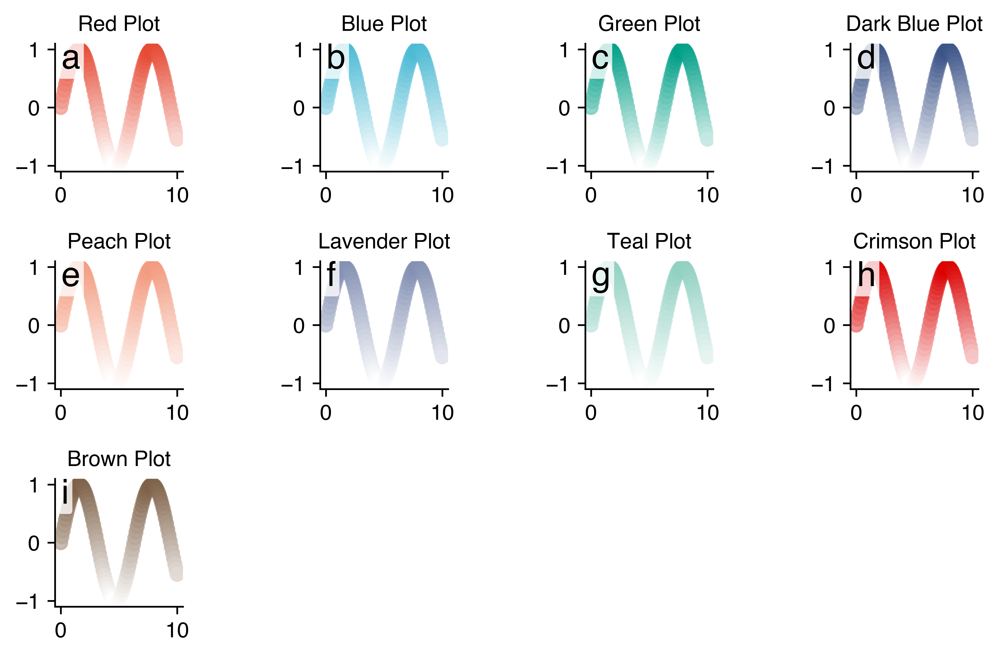

# `bss_plot`


##

```python
from bss_plot import colors
import matplotlib.pyplot as plt
import numpy as np

palette = colors.colorblind_palette
colormaps = palette.create_sequential_colormaps()
n = len(colormaps)
rows = int(
    np.ceil(n / 4)
)  # Adjusts rows based on the length of colormaps, with 4 columns
fig, ax = plt.subplots(nrows=rows, ncols=4)

for i, (name, cmap) in enumerate(colormaps.items()):
    x = np.linspace(0, 10, 100)
    y = np.sin(x)

    ax.flat[i].scatter(x, y, c=y, cmap=cmap)
    ax.flat[i].set_title(f"{name} Plot")
    ax.flat[i].set_box_aspect(1)
    panels.add_panel_number(ax.flat[i], i + 1)

# Hide any unused subplots
for j in range(i + 1, len(ax.flat)):
    fig.delaxes(ax.flat[j])

plt.tight_layout()
plt.savefig("single_color_cmap_example.png", dpi=800)
plt.show()
```

